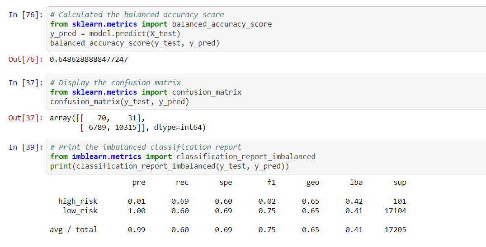
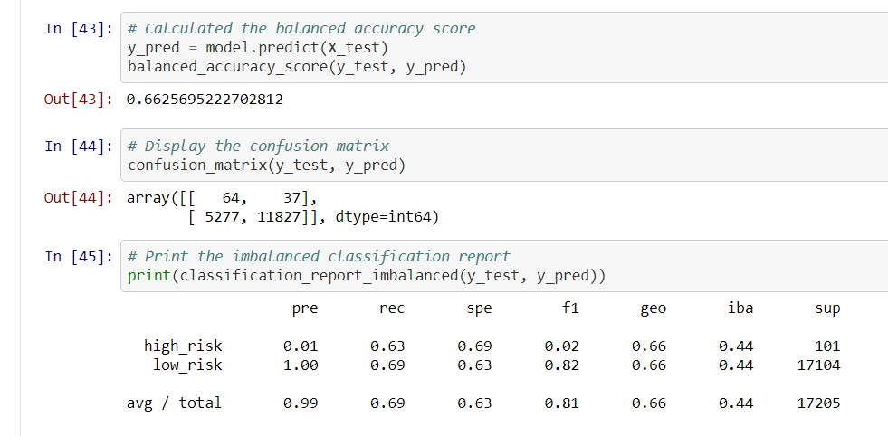
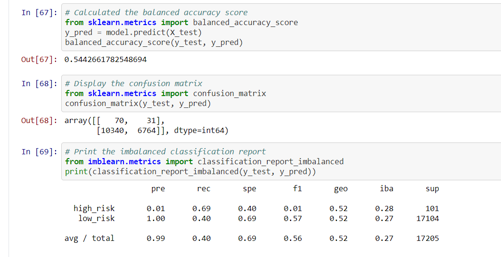
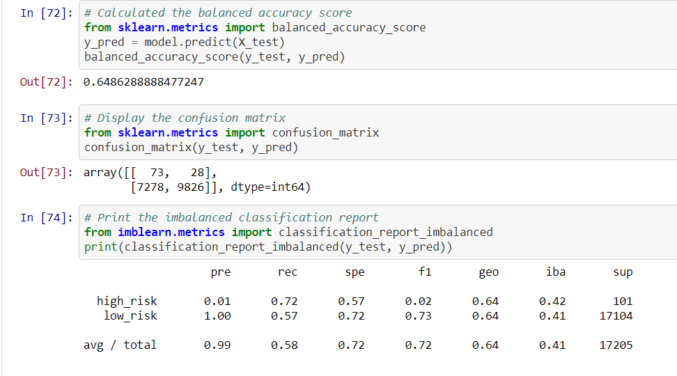
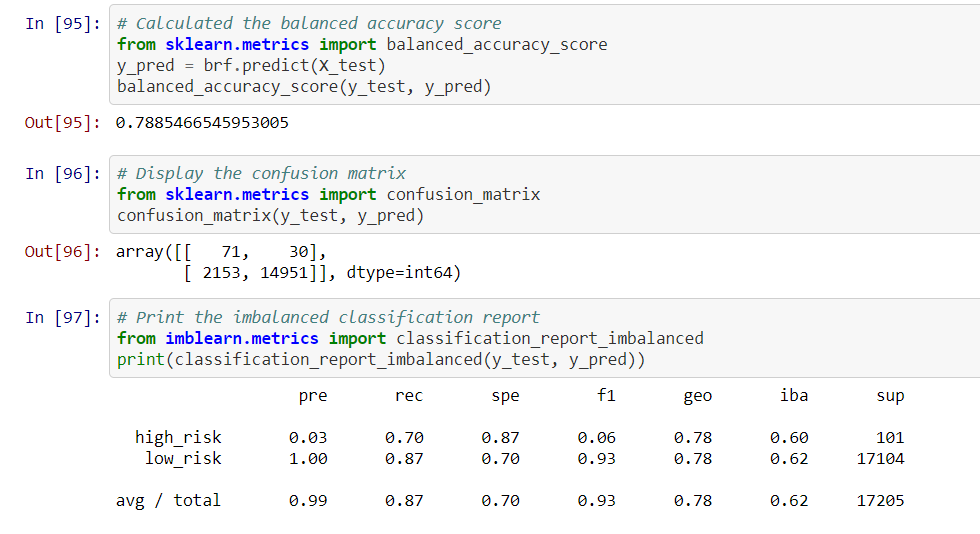
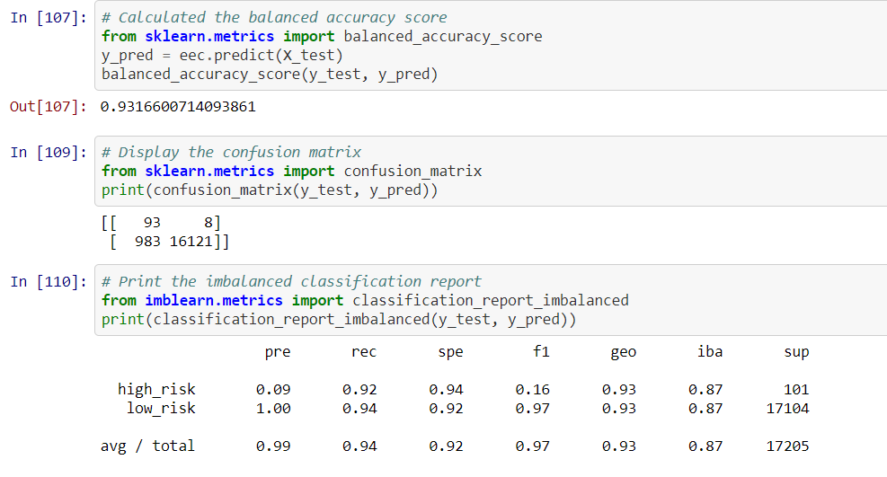

# Credit_Risk_Analysis
machine learning 

## Overview
In this project, we have employed different techniques to train and evaluate models. We have oversampled the data using the RandomOverSampler and SMOTE algorithms and undersample the data using the ClusterCentroids algorithm. Moreover, we have combined both oversampling and undersampling using the SMOTEENN algorithm to evaluate the model performance. We have also applied two new algorithms :BalancedRandomForestClassifier and EasyEnsembleClassifier. We would make evaluation of the performance of all algorithms and choose the one algorithm to predict credit risk with the highest accuracy.

## Results
Here we will show you the blanced accuracy scores, the precision and recall scores for all six machine learning models.
* RandomOverSampler

We have about 0.648 for accuracy score. The precision scores are 0.01 and 1.00 and Recall scores are 0.69 and 0.6 for high risk and low risk respectively.
* SMOTE

We have about 0.663 for accuracy score. The precision scores are 0.01 and 1.00 and Recall scores are 0.63 and 0.69 for high risk and low risk respectively.
* ClusterCentroids

We have about 0.544 for accuracy score. The precision scores are 0.01 and 1.00 and Recall scores are 0.69 and 0.4 for high risk and low risk respectively.
* SMOTEENN

We have about 0.649 for accuracy score. The precision scores are 0.01 and 1.00 and Recall scores are 0.72 and 0.57 for high risk and low risk respectively.
* BalancedRandomForestClassifier

We have about 0.789 for accuracy score. The precision scores are 0.03 and 1.00 and Recall scores are 0.70 and 0.87 for high risk and low risk respectively.
* EasyEnsembleClassifier

We have about 0.931 for accuracy score. The precision scores are 0.09 and 1.00 and Recall scores are 0.92 and 0.94 for high risk and low risk respectively.
## Summary

Summary: Summarize the results of the machine learning models, and include a recommendation on the model to use, if any. If you do not recommend any of the models, justify your reasoning.
